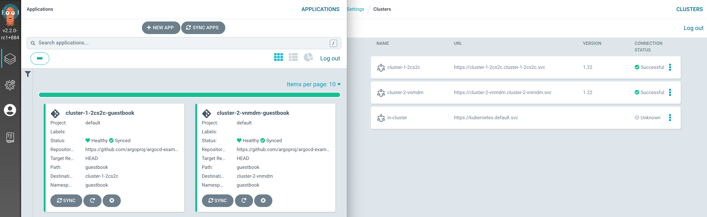

# vcluster with provider-argocd
This repo contains a crossplane composition to spin up [virtual Kubernetes clusters](https://www.vcluster.com/) which are automatically registered at [ArgoCD](https://argo-cd.readthedocs.io/en/stable/) (via [provider-argocd](https://github.com/crossplane-contrib/provider-argocd)):




## Install ArgoCD
Bring up a local ArgoCD instance if you don't have a hosted one available:
```bash
kubectl create ns argocd
kubectl apply -n argocd --force -f https://raw.githubusercontent.com/argoproj/argo-cd/release-2.2/manifests/install.yaml
kubectl -n argocd port-forward svc/argocd-server 8080:8080
```
get admin password for web login:
```bash
kubectl view-secret argocd-initial-admin-secret -n argocd -q
```

add a user for [provider-argocd](https://github.com/crossplane-contrib/provider-argocd):
```bash
kubectl patch configmap/argocd-cm \
  -n argocd \
  --type merge \
  -p '{"data":{"accounts.provider-argocd":"apiKey, login"}}'

kubectl patch configmap/argocd-rbac-cm \
  -n argocd \
  --type merge \
  -p '{"data":{"policy.csv":"g, provider-argocd, role:admin"}}'
```
create JWTs and a corresponding Kubernetes Secret, so that `provider-argocd` is able to connect to ArgoCD:
```bash
ARGOCD_ADMIN_SECRET=$(kubectl view-secret argocd-initial-admin-secret -n argocd -q)
ARGOCD_ADMIN_TOKEN=$(curl -s -X POST -k -H "Content-Type: application/json" --data '{"username":"admin","password":"'$ARGOCD_ADMIN_SECRET'"}' https://localhost:8080/api/v1/session | jq -r .token)
ARGOCD_TOKEN=$(curl -s -X POST -k -H "Authorization: Bearer $ARGOCD_ADMIN_TOKEN" -H "Content-Type: application/json" https://localhost:8080/api/v1/account/provider-argocd/token | jq -r .token)
kubectl create secret generic argocd-credentials -n crossplane-system --from-literal=authToken="$ARGOCD_TOKEN"
```

## Install crossplane
```bash
kubectl create ns crossplane-system
helm install crossplane --namespace crossplane-system crossplane-stable/crossplane
```

### provider-helm
install [provider-helm](https://github.com/crossplane-contrib/provider-helm) to later install the `vcluster` chart via compositions
```bash
kubectl crossplane install provider crossplane/provider-helm:v0.9.0

# in-cluster rbac, so that provider-helm is allowed to install helm charts into the host cluster
SA=$(kubectl -n crossplane-system get sa -o name | grep provider-helm | sed -e 's|serviceaccount\/|crossplane-system:|g')
kubectl create clusterrolebinding provider-helm-admin-binding --clusterrole cluster-admin --serviceaccount="${SA}"

kubectl apply -f provider-helm/providerconfig.yaml
```
### provider-argocd
Install [provider-argocd](https://github.com/crossplane-contrib/provider-argocd) to register the `vcluster` at ArgoCD:
```bash
kubectl crossplane install provider crossplane/provider-argocd:v0.1.0
kubectl apply -f provider-argocd/providerconfig.yaml
```

### provider-kubernetes
Install [provider-kubernetes](https://github.com/crossplane-contrib/provider-kubernetes) to create an ArgoCD `application`:
```bash
kubectl crossplane install provider crossplane/provider-kubernetes:main

SA=$(kubectl -n crossplane-system get sa -o name | grep provider-kubernetes | sed -e 's|serviceaccount\/|crossplane-system:|g')
kubectl create clusterrolebinding provider-kubernetes-admin-binding --clusterrole cluster-admin --serviceaccount="${SA}"
kubectl apply -f provider-kubernetes/providerconfig.yaml 
```

## Kubernetes in Kubernetes
Now that we have everything in place we can get started and schedule some Kubernetes clusters in our host cluster.

First create the composition and the corresponding composite resource definition:
```bash
k apply -f crossplane/composition.yaml
k apply -f crossplane/xrd.yaml
```
And now the actual clusters:
```bash
k apply -f crossplane/xrc.yaml
```
They will show up in the `default` namespace:
```bash
$ kubectl get cluster
NAME        READY   CONNECTION-SECRET   AGE
cluster-1   True                        6m18s
cluster-2   True                        77s
```
For each a respective cluster-scoped resource is created:
```bash
$ kubectl get xcluster
NAME              READY   COMPOSITION                AGE
cluster-1-2cs2c   True    xcluster.cnp.example.org   6m18s
cluster-2-vnmdm   True    xcluster.cnp.example.org   77s
```
And finally there should be new `namespaces` in the host cluster, with pods running `vcluster` and the ArgoCD guestbook application.
At ArgoCD, there should be two Kubernetes clusters and to each a corresponding guestbook application (see screenshot at the top).